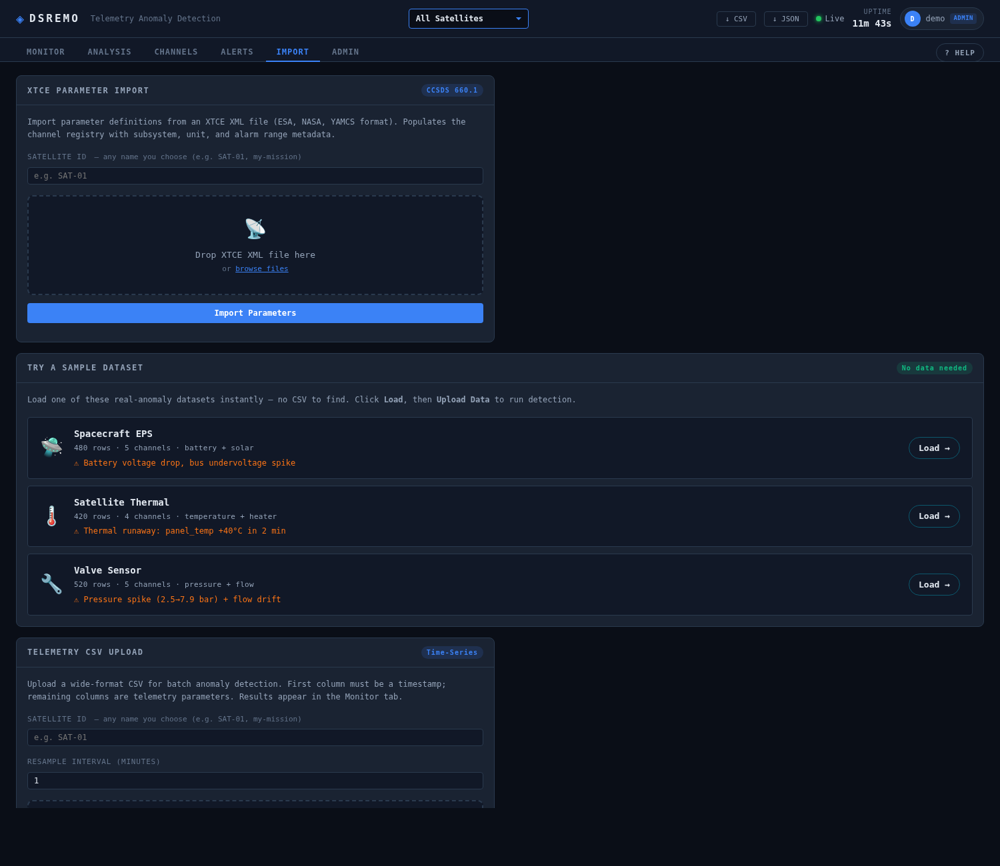
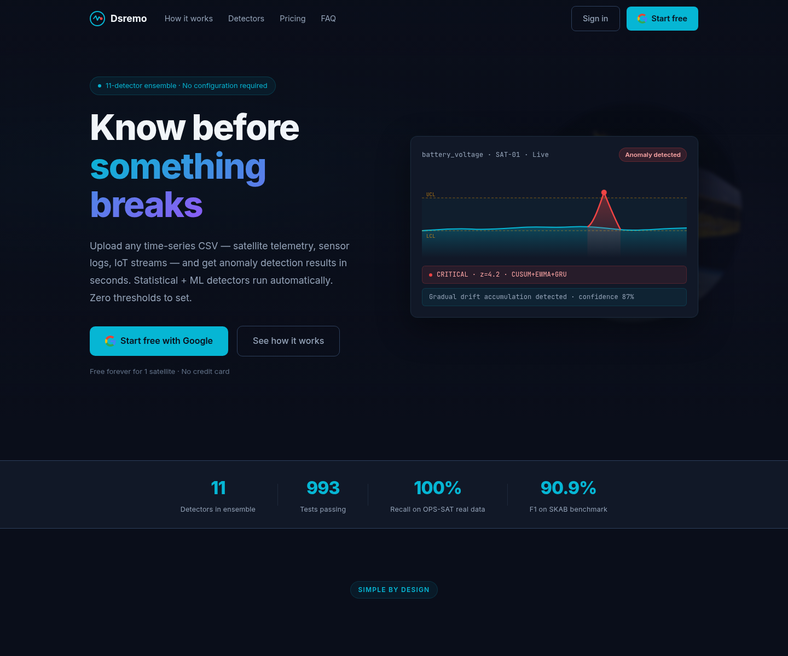
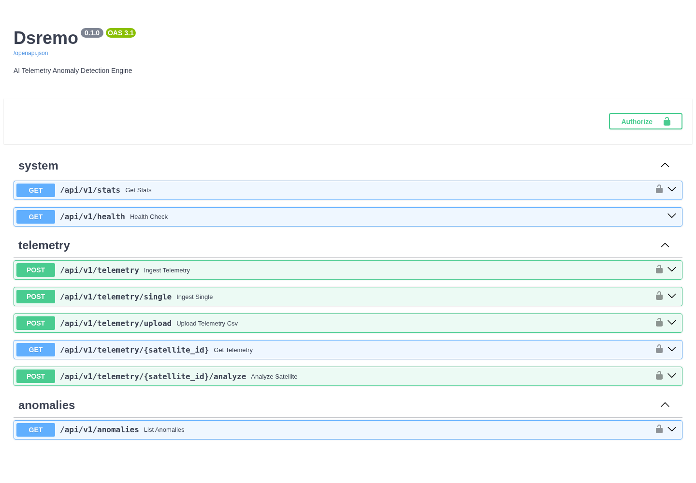

# Telemetry Anomaly Detection

Real-time anomaly detection for satellite and industrial sensor telemetry. Point it at a stream of
sensor readings and it surfaces the moments that matter — degradations, faults, off-nominal events —
each with a confidence score and the detectors that fired. No labelled training data required.

## Screenshots


*Authenticated ops console — live telemetry, anomaly monitor, sample-dataset detection.*





## Why

Satellite and plant operators spend hundreds of engineer-hours a month eyeballing telemetry
dashboards. Real degradations accumulate quietly while on-call engineers get paged at 3 AM for
perfectly normal orbital patterns. A missed anomaly in orbit can cost anywhere from $50K to an
entire mission. The goal here is simple: catch the real events automatically, and stay quiet on
everything else.

## How it works

```
Telemetry (JSON / CSV / InfluxDB) → feature engine → 6-detector ensemble → consensus + root cause → alert
```

- A **consensus ensemble** of six detectors — classical statistical methods alongside deep sequence
  models (**LSTM** and **TCN**, trained per channel) — votes on every window. An event is only
  raised when detectors agree, which is what keeps the false-positive rate low.
- Per-sensor models ship in `SKAB-S16/` (Accelerometer, Current, Pressure, Temperature,
  Thermocouple, Voltage, Volume Flow Rate).
- Every alert carries a confidence score and a root-cause hint — not just a red flag.

## Results

Validated blind (no prior knowledge of the events) against real telemetry:

- **ISS (NORAD 25544):** 4 of 4 known events detected on the validation set, with **zero false
  positives** on normal orbital operations — cross-checked against public NASA/AMSAT records.
- **ESA Mission 1:** 58 channels, ~7.1M telemetry points processed.
- Also benchmarked on the **SKAB** industrial sensor dataset (trained models included in the repo).

Full methodology and tables are in [`docs/BENCHMARK_RESULTS.md`](docs/BENCHMARK_RESULTS.md).

## Run it

```bash
cp .env.example .env     # configure inputs and alerting
docker compose up        # starts the API + detectors
```

A static dashboard for exploring detections lives in `dashboard/` — open `dashboard/index.html` and
load one of the example feeds in `dashboard/samples/` (satellite thermal, spacecraft EPS, valve sensor).

## Stack

Python · PyTorch (LSTM, TCN) · NumPy / Pandas · Docker & docker-compose · AWS

## Status

A working detection engine with reproducible benchmarks and a demo dashboard. Input connectors and
alert routing are configurable; see [`docs/`](docs/) for the detection principles, FMEA mapping, and
the broader design notes.
